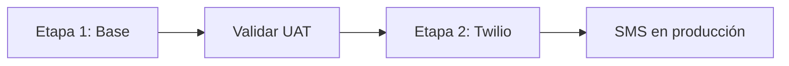

# Fases de despliegue (orden obligatorio)

El backoffice **debe desplegarse y validarse antes de configurar Twilio**.
Con `VITE_TWILIO_MOCK=true` (valor por defecto en producción inicial) la app funciona
completa salvo envíos SMS reales.



---

## Etapa 1 — Despliegue base (sin Twilio)

**Objetivo:** Login, órdenes, tracking público, recordatorios in-app/modal en modo mock.

### Requisitos

- Cuenta Supabase
- Hosting estático (Hostinger u otro)
- **No** hace falta cuenta Twilio

### 1.1 Supabase — proyecto y Auth

1. Crear proyecto Supabase.
2. Settings → Auth: `Site URL` y `Redirect URLs` con el dominio final (HTTPS).
3. Anotar `VITE_SUPABASE_URL` y `VITE_SUPABASE_ANON_KEY`.

### 1.2 Supabase — SQL (sin secretos Twilio)

Ejecutar en SQL Editor, en orden:

| Orden | Archivo | Obligatorio en Etapa 1 |
|-------|---------|------------------------|
| 1 | Tablas base `client` / `receipt` (si no existen) | Sí |
| 2 | [`supabase_migration.sql`](supabase_migration.sql) | Sí |
| 3 | [`TRACKING_SUPABASE_README.md`](TRACKING_SUPABASE_README.md) — `public_id` | Sí |
| 4 | [`security/rls-public-access.md`](security/rls-public-access.md) | Sí |
| 5 | [`sms_sends_migration.sql`](sms_sends_migration.sql) | Sí (prepara Etapa 2) |
| 6 | [`reminder_status_updated_at_migration.sql`](reminder_status_updated_at_migration.sql) | Sí si la DB ya tenía funciones antiguas |

### 1.3 Edge Functions (opcional en Etapa 1)

Puedes desplegar las funciones **sin** secretos Twilio; fallarán solo si alguien intenta SMS real.

```bash
supabase link
supabase functions deploy send-reminder-sms
# send-reminders: NO programar cron ni invocar hasta Etapa 2
```

**No configurar aún:** `TWILIO_*`, `SMS_ALLOWLIST` de producción.

### 1.4 Cron de detección (opcional en Etapa 1)

Solo si quieres probar el modal de recordatorios en UAT (los SMS seguirán en mock):

```sql
CREATE EXTENSION IF NOT EXISTS pg_cron;
SELECT cron.schedule('detect-reminders-daily', '0 6 * * *', $$
  SELECT public.detect_reminders_and_create_tasks('America/Puerto_Rico');
$$);
```

### 1.5 Frontend — build con mock

`.env.production` (o variables en el panel del host):

```env
VITE_SUPABASE_URL=https://tu-proyecto.supabase.co
VITE_SUPABASE_ANON_KEY=tu-anon-key
VITE_TWILIO_MOCK=true
```

```bash
pnpm install
pnpm build
```

Subir `dist/` al host + `.htaccess` SPA (ver [`DEPLOYMENT_PLAN.md`](../DEPLOYMENT_PLAN.md)).

### 1.6 Checklist UAT (Etapa 1)

- [ ] Login / logout
- [ ] Crear orden, listar, cambiar estados, rack, entrega
- [ ] Enlace tracking `/tracking/<public_id>`
- [ ] URL inválida → `/not-found`
- [ ] Botón SMS muestra modo MOCK (no cobra Twilio)
- [ ] (Opcional) Modal recordatorio aparece; envío simula éxito o mock

**Criterio de salida:** operación diaria del taller usable en producción sin SMS real.

---

## Etapa 2 — Activación Twilio (después del despliegue base)

**Objetivo:** SMS reales con guards servidor e idempotencia.

**Precondición:** Etapa 1 validada en el mismo dominio que usará `PUBLIC_APP_URL`.

### 2.1 Cuenta Twilio

- Número SMS activo (PR/US según necesidad)
- Account SID, Auth Token, número `From` en E.164

### 2.2 Secretos Supabase

```bash
supabase secrets set TWILIO_ACCOUNT_SID="AC..."
supabase secrets set TWILIO_AUTH_TOKEN="..."
supabase secrets set TWILIO_FROM="+1..."
supabase secrets set PUBLIC_APP_URL="https://tu-dominio.com"
# Opcional QA:
# supabase secrets set SMS_ALLOWLIST="+17875550101"
```

Redesplegar por si acaso:

```bash
supabase functions deploy send-reminder-sms
```

### 2.3 Batch automático (opcional)

```bash
supabase functions deploy send-reminders --no-verify-jwt
```

Proteger la URL (solo cron interno / service role). No exponer públicamente sin auth.

### 2.4 Frontend — quitar mock

Actualizar variables en el host y **rebuild + redeploy**:

```env
VITE_TWILIO_MOCK=false
```

### 2.5 Checklist go-live SMS

- [ ] Orden `LISTO` + rack → SMS llega al teléfono de prueba
- [ ] Reintento mismo día → `DUPLICATE` (sin segundo cargo)
- [ ] Recordatorio modal con teléfono real (E.164)
- [ ] Presupuesto / kill switch probados en staging si aplica

---

## Resumen

| | Etapa 1 (primero) | Etapa 2 (después) |
|--|-------------------|-------------------|
| Twilio | No | Sí |
| `VITE_TWILIO_MOCK` | `true` | `false` |
| Edge `send-reminder-sms` | Opcional | Con secretos Twilio |
| `send-reminders` cron | No recomendado | Cuando Twilio listo |
| Uso en taller | Sí | SMS reales |

Guías relacionadas: [`TWILIO_SETUP.md`](TWILIO_SETUP.md), [`DEPLOYMENT_PLAN.md`](../DEPLOYMENT_PLAN.md).
